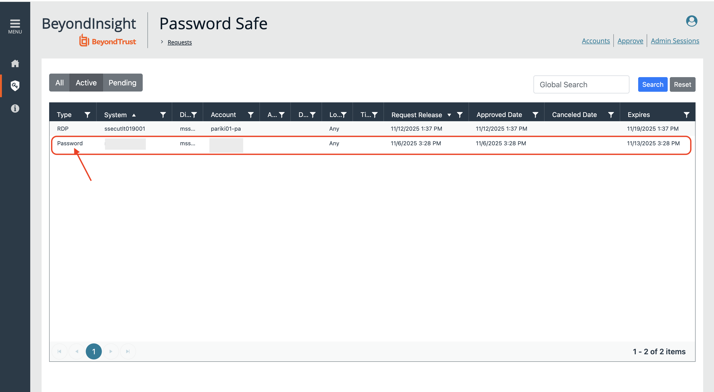

# AWS-LOGIN-SOP

## Step 1: Log into PasswordSafe

Go to [https://passwordsafe.mountsinai.org/](https://passwordsafe.mountsinai.org/)  
Use your Mount Sinai email in the format and login:

```
userID@mssm.edu
```

---

## Step 2: Open AWS Portal in Incognito Mode

Open a new **Incognito Window** in your browser and go to:  
[https://mountsinai-research.awsapps.com/start#/](https://mountsinai-research.awsapps.com/start#/)

  

---

## Step 3: Log in with PA User ID in the AWS link

Log in using your **PA ID** in the format:

```
userid-pa@mssm.edu
```
---

## Step 4: Retrieve password from Passwordsafe
Go to "Systems"

  

  

Use the password stored in **PasswordSafe**.
  


## Now you have access to AWS

  

You can search for s3 bucket in the search tab
  


---

## Notes

- If you do not have a PA user ID, submit a request to the IT department specifying your project and the need for AWS access.  
- When signing up for the first time, authenticate the PA account using authenticator
